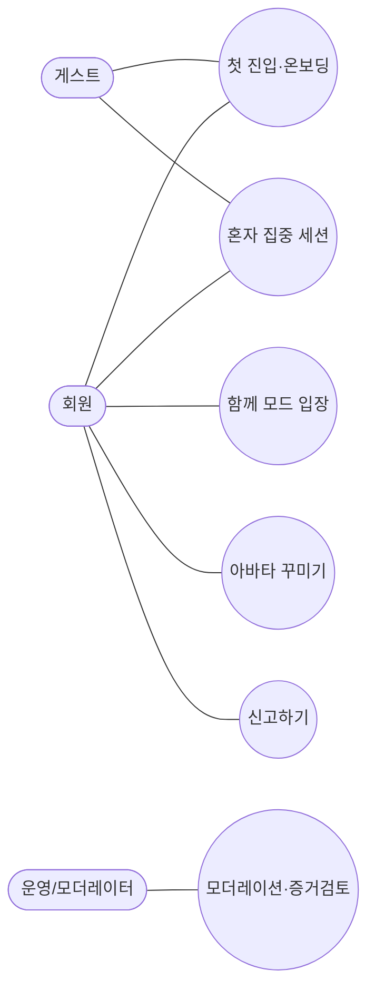

# 기능 명세 & 유즈케이스 — 마스킹 캠스터디

> 이 문서는 **"무엇을 만드는가"**를 다룬다. **"왜"**는 [기획서.md](기획서.md) 참고.
> 우선순위: **P1 = MVP(혼자 모드 완결)**, P2 = 함께 모드/네트워크, P3+ = 지능화·소셜.

---

## 1. 유즈케이스 다이어그램

액터(사람) 관점에서 누가 어떤 기능을 쓰는지 한눈에 본 그림. 상세 단계는 [3. 핵심 유즈케이스](#3-핵심-유즈케이스) 참고.

- **액터**: 게스트 / 회원 / 운영·모더레이터 — 시스템 밖에서 기능을 쓰는 주체.
- **타원**: 각 유즈케이스(기능). **선**: 해당 액터가 그 기능을 사용할 수 있음.
- 게스트는 가입 없이 온보딩·혼자 세션까지(가치 우선 체험). 함께 모드·꾸미기·신고는 회원부터.

---

## 2. 기능 도메인 전체 목록

### A. 계정 / 온보딩
| ID | 기능 | 단계 | 비고 |
|---|---|---|---|
| A-1 | 게스트 체험(로그인 없이 첫 세션) | P1 | 이탈 방지 — 가치 먼저 체험 후 가입 유도 |
| A-2 | 회원가입 / 로그인 (소셜로그인 우선) | P1 | 기록 저장·동료 모드 전제 |
| A-3 | 카메라 권한 요청 및 가이드 | P1 | 거부 시 대체 흐름 안내 |
| A-4 | 연령 확인 | P1 | 미성년자 정책의 출발점 |
| A-5 | 프라이버시 동의 (로컬 처리·모더레이션 범위 고지) | P1 | 기획서 6번과 연동 |

### B. 아바타
| ID | 기능 | 단계 |
|---|---|---|
| B-1 | 아바타 선택(프리셋) | P1 |
| B-2 | 캘리브레이션 (얼굴 ↔ 아바타 모션 매핑, 조명/위치 보정) | P1 |
| B-3 | 아바타 커스터마이징(기본) | P1 |
| B-4 | 코스메틱 장착/교체 | P2 |

### C. 세션 — 혼자 모드
| ID | 기능 | 단계 |
|---|---|---|
| C-1 | 집중 세션 시작 / 종료 | P1 |
| C-2 | 집중 타이머 (목표 시간 설정) | P1 |
| C-3 | 내 상태 실시간 표시 (거치된 폰 = 감독관 느낌) | P1 |
| C-4 | 세션 일시정지 / 휴식 | P1 |

### D. 감지 / 피드백
| ID | 기능 | 단계 |
|---|---|---|
| D-1 | 부재(자리 비움) 감지 | P1 |
| D-2 | 고개 숙임 / 자세 감지 | P1 |
| D-3 | 시선 방향 감지 (보조) | P1 |
| D-4 | 임계값 + 시간 지연 기반 오탐 방지 | P1 |
| D-5 | 규칙기반 경고 / 격려 메시지 (텍스트·음성) | P1 |
| D-6 | AI 감독관 자연어 대화 (WebLLM) | P3 |

### E. 스터디룸 — 함께 모드
| ID | 기능 | 단계 |
|---|---|---|
| E-1 | 룸 생성 (공개 / 비밀방) | P2 |
| E-2 | 세션 예약 / 매칭 (자유입장 아님 — 콜드스타트 회피) | P2 |
| E-3 | 룸 입장 / 퇴장 | P2 |
| E-4 | 룸 목록 / 검색 | P2 |
| E-5 | 동료 아바타 모션 스트림 표시 | P2 |
| E-6 | 룸 내 가벼운 상호작용 (응원·이모지) | P2 |

### F. 안전 / 모더레이션
| ID | 기능 | 단계 |
|---|---|---|
| F-1 | 신고 버튼 | P2 |
| F-2 | 차단 / 추방 | P2 |
| F-3 | on-device 부적절 행동 선검사 → 차단/블러 | P2 |
| F-4 | 증거 로그 보존 + 사람 검토 큐 | P2 |
| F-5 | 녹화/캡처 방지 정책 적용 | P2 |

### G. 리포트 / 기록
| ID | 기능 | 단계 |
|---|---|---|
| G-1 | 세션 종료 요약 (집중/이탈 시간) | P1 |
| G-2 | 세션 히스토리 (로컬 저장) | P1 |
| G-3 | 집중도 수치화 / 대시보드 | P3 |

### H. 코스메틱 / 경제
| ID | 기능 | 단계 |
|---|---|---|
| H-1 | 재화 시스템 뼈대 (집중으로 earn) | P1 (뼈대) |
| H-2 | 상점 / 구매(buy) | P2 |
| H-3 | 인벤토리 | P2 |
| H-4 | 시즌제 / 한정 드롭 | P3+ |
| H-5 | UGC 마켓 (크리에이터 판매) | 장기 |

### I. 소셜
| ID | 기능 | 단계 |
|---|---|---|
| I-1 | 친구 / 팔로우 | P3 |
| I-2 | 스터디 그룹 / 길드 | P3 |
| I-3 | 랭킹 / 리더보드 | P3+ |

---

## 3. 핵심 유즈케이스

> MVP에 직접 필요한 UC-1, UC-2를 상세히 기술한다. UC-3·UC-4는 P2 개요만.

### UC-1. 첫 진입 & 온보딩 (P1)

- **액터**: 신규 사용자
- **목표**: 처음 들어와 첫 집중 세션까지 도달
- **사전조건**: 카메라가 있는 기기, 브라우저 접속

| # | 사용자 행동 | 시스템 반응 |
|---|---|---|
| 1 | 서비스 접속 | 가치 소개 + "바로 체험하기"(게스트) 제공 |
| 2 | 체험 시작 | 카메라 권한 요청 및 이유 설명 |
| 3 | 권한 허용 | 얼굴 인식 시작, 아바타 프리셋 제시 |
| 4 | 아바타 선택 | 캘리브레이션 안내(정면 응시 등) |
| 5 | 캘리브레이션 완료 | 내 얼굴이 아바타로 마스킹되어 화면에 표시 |
| 6 | "집중 시작" | 세션 시작 → UC-2로 |

- **대체 흐름**: 3에서 권한 거부 → 카메라 없이 쓸 수 있는 제한 모드 안내 또는 종료.
- **예외**: 얼굴 미검출(조명/위치) → 재배치 가이드.

### UC-2. 혼자 집중 세션 (P1) — *MVP의 심장*

- **액터**: 사용자(게스트 또는 회원)
- **목표**: 한 번의 집중 세션을 완료하고 결과 확인

| # | 사용자 행동 | 시스템 반응 |
|---|---|---|
| 1 | 목표 시간 설정 후 시작 | 타이머 가동, 아바타 마스킹 라이브, "감독관 ON" 표시 |
| 2 | 공부 진행 | 부재/자세/시선 실시간 감지(D-1~3) |
| 3 | 잠깐 고개를 돌림 | 임계값/지연(D-4)으로 **경고하지 않음** |
| 4 | 일정 시간 자리 비움 | 부재 판정 → 격려/환기 메시지(D-5) |
| 5 | 복귀 / 계속 집중 | 집중 시간 누적, (H-1) 재화 적립 |
| 6 | 세션 종료 | 요약 리포트(집중/이탈 시간) 표시(G-1), 히스토리 저장(G-2) |

- **대체 흐름**: 1에서 휴식 → 타이머 일시정지(C-4).
- **예외**: 세션 중 권한/카메라 끊김 → 일시정지 + 복구 안내.
- **수용 기준(예시)**: 자연스러운 스트레칭을 부재로 오탐하지 않는다 / 종료 후 요약이 정확히 집계된다.

### UC-3. 함께 모드 입장 (P2, 개요)

예약 → 시간에 룸 입장 → 동료 아바타 모션 스트림 표시(E-5) → 함께 세션(UC-2 확장) → 종료. 자유입장이 아닌 **예약/매칭**으로 빈 방 문제를 피한다.

### UC-4. 부적절 행동 신고 / 차단 (P2, 개요)

on-device 선검사가 의심 감지(F-3) → 즉시 블러/차단 → 강제 퇴장 → 증거 로그 보존(F-4) → 사람 검토. 또는 동료가 신고(F-1) → 검토 큐. 플랫폼은 차단·증거보존·신고지원까지(소송 주체 아님).

---

## 4. MVP 개발 순서 (빌드 체크리스트)

> ✅ **선검증 스파이크 통과** (2026-08): iPhone 15 Pro Safari에서 MediaPipe 아바타 마스킹 + 부재/자세 감지 FPS 유지 확인. 발열 최적화(추론 10Hz, 카메라 480p/15fps, 렌더 해상도 제한, 보간) 적용 — [spike/index.html](spike/index.html) 참고. 이 최적화는 제품 코드에 그대로 가져갈 것.

의존성 순서로 배열: **엔진(1~3) 먼저, UI(4~7)는 그 위에.** 화면부터 만들면 엔진 붙일 때 다시 뜯게 된다. 매 단계 끝날 때마다 폰(터널 or dev 서버)에서 확인 가능하게 구성.

- [ ] **0. 준비**: Next.js 스캐폴딩, CLAUDE.md의 "현재 상태"를 실제 빌드/테스트 명령으로 교체
- [ ] **1. 비전 파이프라인 모듈화**: 스파이크 코드 → 재사용 모듈(`useFaceTracking` 훅: 랜드마크/블렌드셰이프/머리각도 출력, 발열 최적화 포함)
- [ ] **2. 감지 엔진** (D-1, D-2, D-4): 부재/고개숙임 판정 + 임계값·지연 로직 — UI 없이 단위 테스트 가능한 순수 로직으로 분리. 오탐 방지가 MVP 핵심이므로 테스트를 여기에 집중
- [ ] **3. 세션 엔진** (C-1, C-2, C-4): 상태 머신(대기 → 집중 → 일시정지/휴식 → 종료) + 타이머 + 집중/이탈 시간 누적
- [ ] **4. 아바타** (B-1, B-2): 프리셋 2~3종 + 캘리브레이션(정면 응시 → 기준 각도 저장) + 마스킹 렌더링
- [ ] **5. 규칙기반 메시지** (D-5): 감지 이벤트 → 상황별 메시지 (+ Web Speech 음성, 선택)
- [ ] **6. 온보딩** (UC-1: A-1, A-3): 랜딩 → 게스트 체험 → 권한 가이드 → 아바타 선택 → 캘리브레이션 → 세션. 권한 거부/얼굴 미검출 예외 처리 포함
- [ ] **7. 리포트 + 저장** (G-1, G-2): 세션 종료 요약(집중/이탈 시간) + IndexedDB 히스토리
- [ ] **8. (선택) 재화 뼈대** (H-1): 집중 시간 → 포인트 적립만. 상점 없음
